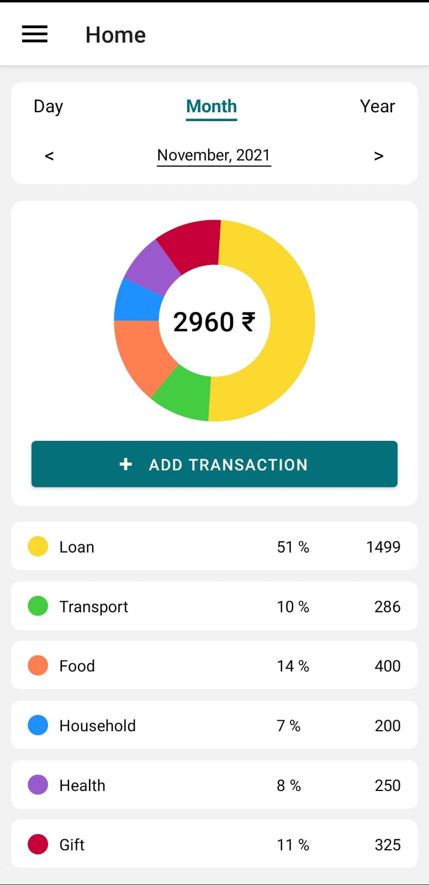
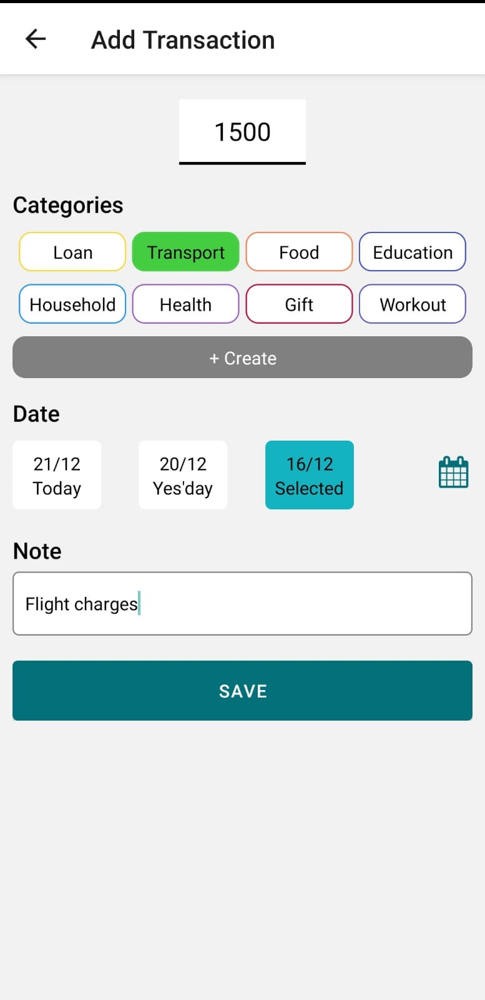

# SpendWise

SpendWise helps users easily track expenses and gain control over their finances.
It promotes smart budgeting, prevents overspending, and supports better financial planning with simple and real-time tracking.
|                              Home                               |                             Add Expense                             |
| :-------------------------------------------------------------: | :-----------------------------------------------------------------: |
|  |  |


## Run Locally

Clone the project

```bash
  git clone https://github.com/arsan13/expense-tracker-app.git
```

Go to the project directory

```bash
  cd expense-tracker-app
```

Install dependencies

```bash
  npm install
```

Start Metro

```bash
  npx react-native start
```

Start the application

```bash
  npx react-native run-android
```
